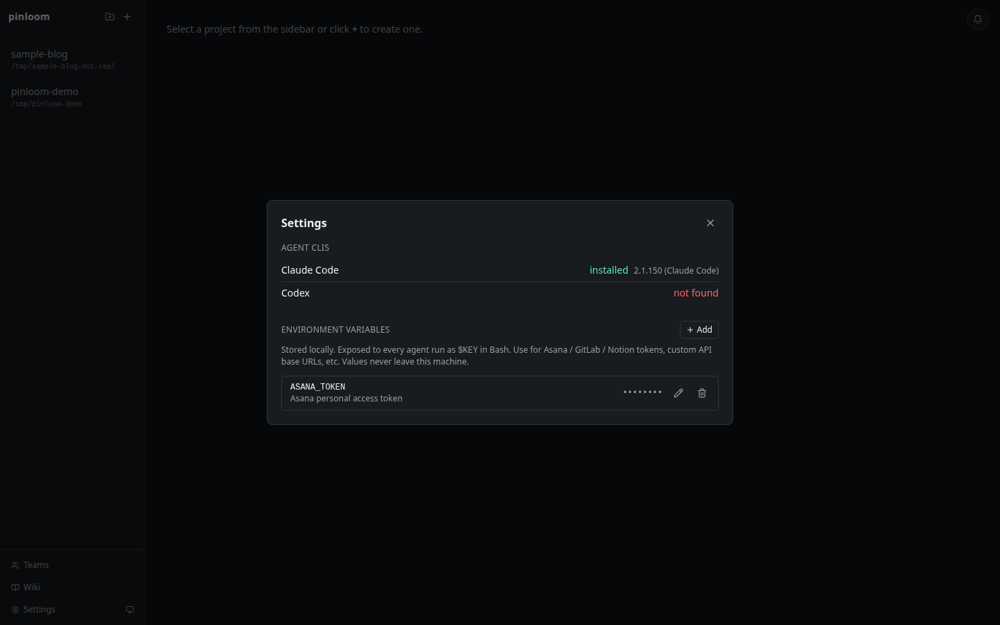

# Environment variables

pinloom lets you register environment variables once in **Settings →
Environment Variables**, and every agent run inherits them. No more
copy-pasting tokens into chat or hand-editing `~/.bashrc` for each new
integration.

## What it does

- Stored in pinloom's SQLite (`user_env` table), under
  `~/.pinloom/data/pinloom.sqlite` (or wherever `PINLOOM_DB_PATH` points).
- Mirrored into the backend's `process.env` on save and on startup. The
  Claude Agent SDK's `Bash` tool and any Codex subprocess inherit them
  automatically — no per-adapter wiring needed.
- Optional **`secret`** flag → masks the value in the UI **and** scrubs
  the value from any tool output that gets broadcast over the websocket.

## Typical uses

| Key                  | Why                                                |
|----------------------|----------------------------------------------------|
| `ASANA_TOKEN`        | Let the agent post comments on Asana tasks         |
| `GITLAB_TOKEN`       | Let the agent open MRs / read pipelines            |
| `NOTION_TOKEN`       | Let the agent read internal design docs            |
| `OPENAI_API_KEY`     | Override the agent's default LLM for one project   |
| `STAGING_API_BASE`   | Point the agent at a staging endpoint by default   |

Anything you'd normally `export` in your shell — but scoped to pinloom
sessions, persistent across reboots, and masked in the UI.

## Security notes

- **`is_secret` only controls UI masking; it is not a security
  boundary.** Anyone with shell access to the host can read
  `process.env`. On Linux, any process running as your user can read
  the backend's full env via `/proc/<pid>/environ` — a rogue npm
  postinstall script or a malicious editor extension counts. The flag
  exists so screen-sharers don't see your tokens in the table, not to
  protect against local exfiltration.
- **Stored in plaintext on disk.** Back up `~/.pinloom/data/` with
  the same care you give `~/.bashrc` or `~/.ssh/`. The
  `data/pinloom.sqlite-wal` and `-shm` sidecar files contain the
  same values during writes. The Wiki export zip is safe (separate
  directory), but a full `~/.pinloom/` archive is not.
- **Short values bypass output redaction.** The redaction layer that
  scrubs secret values from broadcast tool output ignores anything
  under 8 characters — short tokens would generate too many false
  positives in regular text. If your token is unusually short,
  don't rely on the scrubber.
- **Values never leave your machine.** The backend reads them from
  SQLite and merges them into `process.env`; the frontend never sees
  the raw value after save.

## Reserved keys

None. pinloom uses the `PINLOOM_` prefix for its own internals (so the
unlikely chance of collision is yours to avoid). You can override
`PATH`/`HOME`/etc. if you really want to.

## Key format

Must match POSIX identifier rules: `/^[A-Za-z_][A-Za-z0-9_]*$/`. The
UI rejects anything else.
