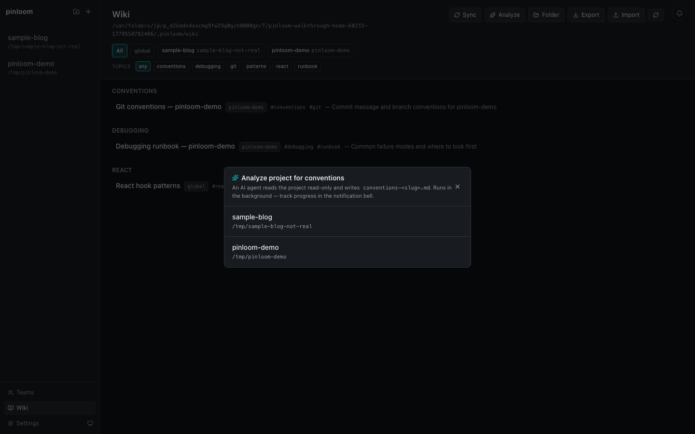
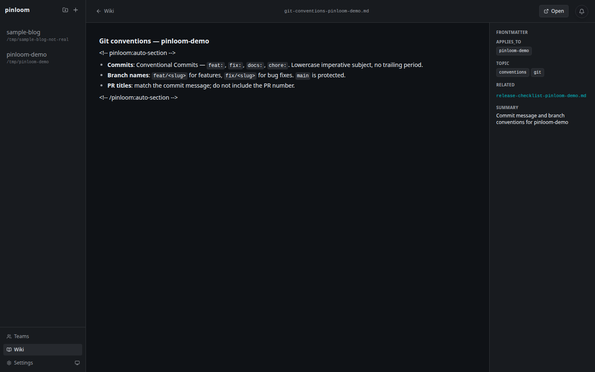

# Wiki — persistent personal knowledge

pinloom's Wiki is a per-user, per-machine markdown knowledge base at
`~/.pinloom/wiki/`. The agent reads it at the start of every turn and
filters pages by project, so notes from one repo don't leak into another.


## Why it exists

Claude Code's session memory dies with the session. The Wiki survives:
agent restarts, `~/.claude/` resets, machine reboots, and version
bumps. It's where durable, reusable knowledge accumulates over time —
project conventions, debugging shortcuts, API quirks, lessons learned
from past incidents.

## Two ways to populate it

### 1. Sync from a session

`Wiki → Sync` pulls everything new from a chat session and asks an
agent to file each insight into the right page. The agent reads
`_schema.md` for conventions and `index.md` for what already exists,
then writes new pages or appends to existing ones — only inside
`<!-- pinloom:auto-section -->` markers so your hand-edits are
preserved.

### 2. Analyze a project's codebase

`Wiki → Analyze` runs a one-shot pass over a project's repo,
extracting conventions (naming, layout, lint rules, build commands,
test patterns) into a `conventions-<slug>.md` page.



## What a page looks like

Each page renders with its frontmatter shown in a side rail — applies_to,
topic, related, and a one-line summary. Body markdown is regular Markdown
plus the `<!-- pinloom:auto-section -->` markers that separate
agent-managed content from your hand-edits.



## Layout

```
~/.pinloom/wiki/
├── _schema.md           # user-editable, agent reads on every sync
├── index.md             # auto-maintained inside auto-section markers
└── pages/
    ├── git-conventions-myrepo.md
    ├── react-hooks-patterns.md           # global / cross-project
    └── deploy-runbook-myrepo.md
```

Every page has YAML frontmatter:

```yaml
---
applies_to: [myrepo]              # or [global], or multiple slugs
topic: [git, conventions]
related: [release-checklist-myrepo.md]
summary: "How we structure commits and branches in myrepo"
---
```

The reading agent filters pages by `applies_to` against the active
project's slug — so a rule tagged for `repo-a` never bleeds into
sessions for `repo-b`.

## Auto vs manual content

The sync agent only edits inside the `<!-- pinloom:auto-section -->`
markers within each page. Anything outside is yours — frontmatter, free
notes, hand-written sections — and is preserved verbatim across
syncs.

## Export / import

`Wiki → Export` produces a zip; `Wiki → Import` ingests one (after
backing up the current state to `~/.pinloom/wiki-backups/`). Useful
when migrating machines or sharing a curated subset with a teammate.

## Filters

The header chips filter by:

- **scope** — show only pages applying to a specific project (or `global`)
- **topic** — show only pages tagged with a topic

## Where this fits in the design

The Wiki is the *long-term* layer — durable, project-scoped knowledge
that survives session resets. Chat is the *current turn* layer. The
agent reads the wiki on every turn, so anything you commit there
becomes context the agent always sees; anything that only lives in a
single session's chat history is fleeting. The Wiki sync action is
the bridge: it asks Claude to read the session's recent messages and
write the lessons learned out as wiki updates, so a finished task
ends up as durable knowledge instead of buried-in-chat lore.
