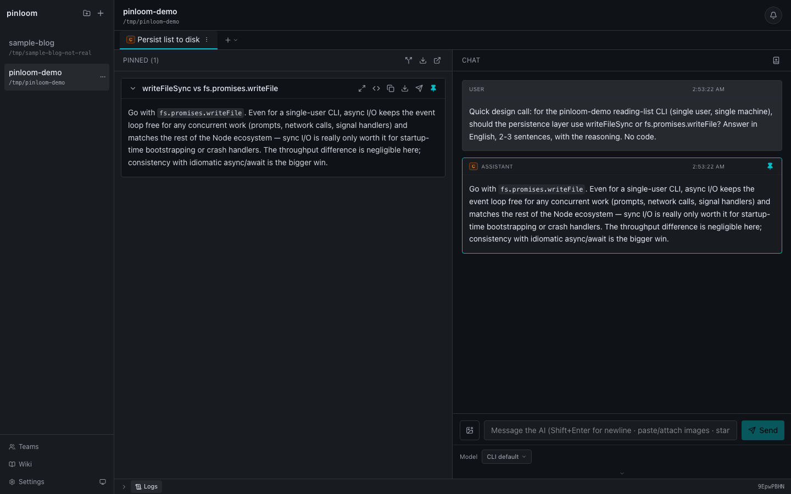
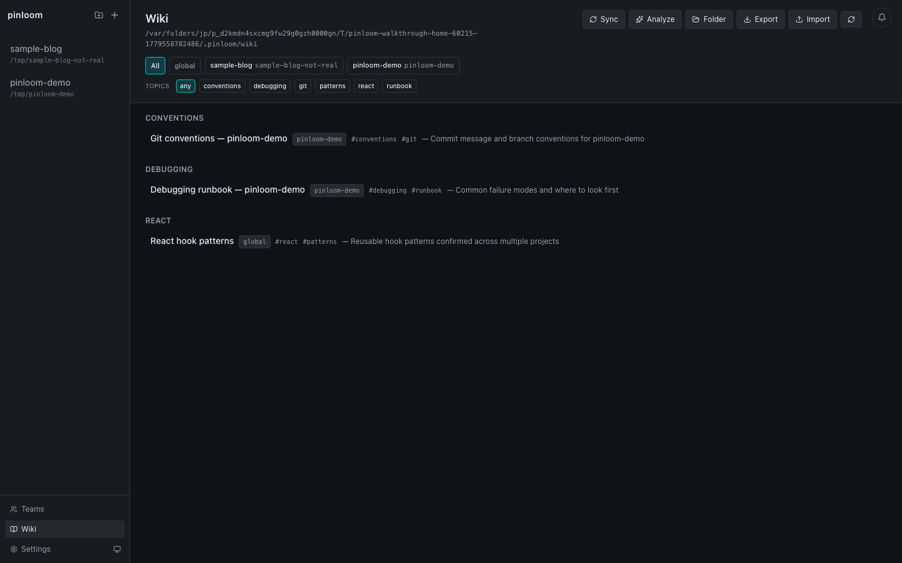
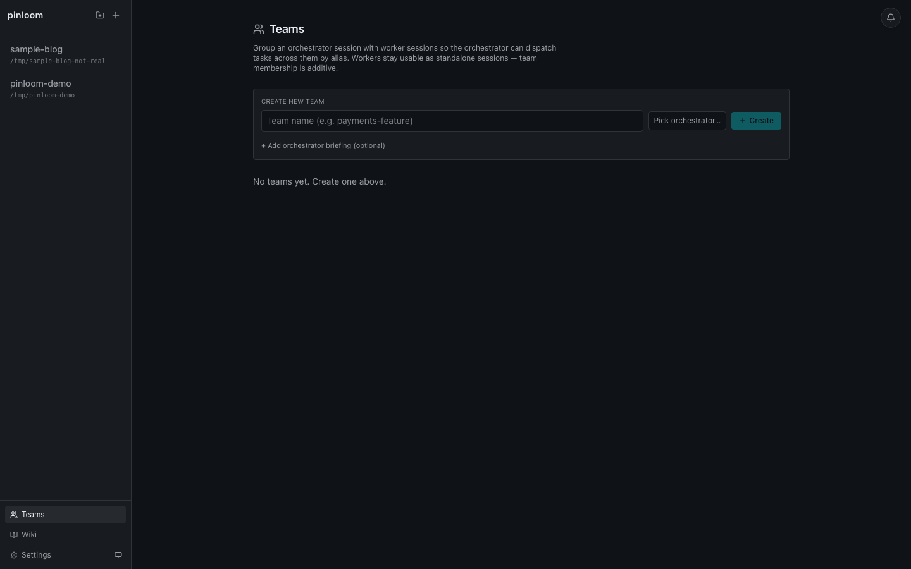
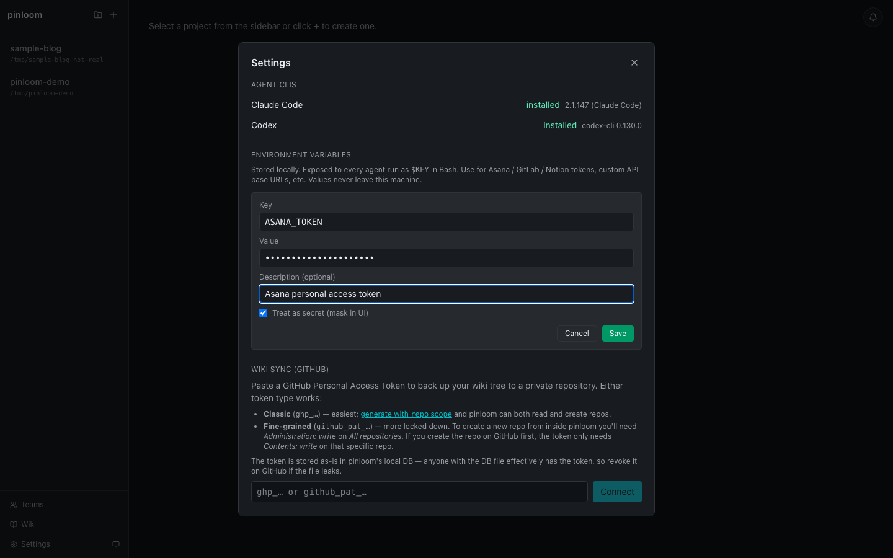

# Reddit launch post — draft

> **Pre-launch checklist (do not skip):**
> - [ ] Upload `docs/walkthrough.webm` to YouTube as Unlisted and
>       paste the URL into the post body where indicated.
> - [ ] Replace inline `./screenshots/...` markdown with direct uploads
>       to Reddit's image gallery — Reddit posts do not render
>       relative-path markdown images.
> - [ ] Final read-through of the FAQ; rehearse 1-line answers.

## Recommended subreddits (in order)

1. **r/ClaudeAI** — friendliest audience; people there already use Claude
   Code and want better UIs around it.
2. **r/LocalLLaMA** — they care about local-first, no-cloud, owning your
   own data. Lead the post-1-week follow-up there with the SQLite +
   Wiki + GitHub-backup angle.
3. **r/programming** — last, and only if the first two went well.
   r/programming is unforgiving of "I built X" posts and especially
   skeptical of wrappers.

Avoid r/SideProject for now — the audience there is non-technical and
the technical pitch lands flat.

---

## Title (pick one)

- **A (recommended for r/ClaudeAI)** —
  `I kept losing Claude Code session history, so I built a local UI that owns the database`
  *(89 chars; pain-point-first framing, no marketing voice.)*
- **B (recommended for r/programming)** —
  `Show: pinloom — local Claude Code workspace with persistent history, pinning, Wiki, Teams orchestration, and GitHub backup`
  *(120 chars; Show-style, technical.)*
- **C (alternate, lighter)** —
  `pinloom — a local UI for Claude Code that doesn't forget`
  *(56 chars; punchy.)*

---

## Body

> Hey — I've been using Claude Code daily for the last few months and
> kept running into the same problems:
>
> 1. **Session memory dies with the session.** Switching machines, a
>    `~/.claude/` cleanup, or hitting the wrong button — and the full
>    transcript was gone. The lessons learned with it.
> 2. **Answers I needed to keep in front of me kept scrolling out of
>    view.** Every long debugging session, the one message that
>    summarized the fix would end up 200 messages up.
> 3. **My env tokens lived in 4 different shell init files** and I
>    never knew which one the agent was actually inheriting.
> 4. **Conventions I taught the agent in one session didn't carry
>    over to the next**, so I'd start each chat reminding it of the
>    same things.
>
> So I built **pinloom**: a local-only React/Fastify workspace that
> wraps `@anthropic-ai/claude-agent-sdk`. A handful of things make it
> noticeably different from running the CLI directly:
>
> ### 1. pinloom's own SQLite owns the conversation history
>
> Every user message, assistant reply, and tool call is mirrored to
> `data/pinloom.sqlite` the moment it streams in. `~/.claude/` resets,
> SDK version bumps, and laptop swaps no longer erase your context.
> Sessions are first-class — you can pop one open from any project
> and the entire transcript is there.
>
> ### 2. Pin AI answers so they stay visible
>
> Right-click an assistant message, "Pin" — it docks to the side
> panel and stays there while you keep chatting. The next time you
> need that fix, that one-liner, that gotcha, it's two pixels away
> instead of 200 scroll-up away.
>
> 
>
> ### 3. Persistent Wiki the agent reads on every turn
>
> Per-project markdown notes at `~/.pinloom/wiki/`. Sync from a chat
> session (the agent reads recent messages and updates the wiki) or
> analyze a project's codebase for conventions. Pages declare
> `applies_to: [<slug>]` in frontmatter so rules from one repo don't
> leak into sessions for another. The wiki itself is editable
> in-place with a split-pane preview, or you can edit the markdown
> files directly on disk — pinloom picks up the changes.
>
> 
>
> ### 4. Teams — orchestrator + workers via MCP
>
> Group one orchestrator session with N worker sessions. The
> orchestrator gets an MCP server exposing nine tools; it dispatches
> to workers by alias (`team_ask('@be', '...')`) or broadcasts to a
> tag (`team_ask_tag('frontend', '...')`). `team_ask` blocks
> synchronously until the worker replies, mirroring the Claude SDK's
> Task tool — so the orchestrator's turn stays alive across the
> round-trip and can synthesize replies from multiple workers in one
> pass.
>
> 
>
> ### 5. GitHub-backed backup
>
> Paste a GitHub PAT into Settings, pick or create a private repo,
> click "Sync now". Your wiki tree gets pushed to that repo with a
> meaningful git history (since it's all markdown, diffs and blame
> still mean something). On a new machine, same setup + "Restore
> from repo" pulls the wiki down. The session database lives off the
> git side as a single downloadable JSON file — same idea, but with
> a portable file path instead of git churn for binary blobs.
>
> **Other features worth noting:**
>
> - **Env vars, registered once.** Settings → Environment Variables.
>   Stored locally, merged into every agent run's `process.env`.
>   Optional `secret` flag masks the value in the UI and scrubs it
>   from any tool output that gets broadcast.
>
>   
>
> **Design rules:**
>
> - **Local-only MVP.** No auth, no cloud, no multi-user. Runs on
>   `localhost:4747`.
> - **Explicit deletion only.** Nothing auto-purges; if it's there,
>   you put it there.
> - **Sessions are owned by pinloom, not Claude Code.** See feature
>   #1 above.
>
> **Stack:** React 19 + Vite + Tailwind v4 on the frontend, Fastify
> + better-sqlite3 + WS on the backend, `@anthropic-ai/claude-agent-sdk`
> for the runner. MIT licensed, single `pnpm install && pnpm start`
> to run.
>
> Repo: https://github.com/gjeon03/pinloom
> Demo (1 min, unlisted): TODO — paste YouTube link before posting.
>
> Happy to answer design or SDK-integration questions in the comments.

---

## Assets to attach

Reddit lets you attach up to 20 images per gallery post. Recommended set,
in this order:

1. `docs/screenshots/05-project-workspace.png` — opening "what it looks like" shot
2. `docs/screenshots/02-settings-modal.png` — Settings layout (Agent CLIs, Env vars, Wiki sync + GitHub PAT input, Database file download/upload)
3. `docs/screenshots/06-wiki-populated.png` — Wiki dashboard with real pages
4. `docs/screenshots/07-wiki-page-detail.png` — a Wiki page rendered with frontmatter and the Edit button visible
5. `docs/screenshots/07b-wiki-page-edit.png` — Wiki page inline editor: textarea + live preview + frontmatter inputs
6. `docs/screenshots/08-wiki-analyze-picker.png` — Analyze picker
7. `docs/screenshots/09-teams-empty.png` — Teams creation
8. `docs/screenshots/03-env-var-add-form.png` — env var feature
9. `docs/screenshots/04-env-var-saved.png` — env var saved state

For the video: upload `e2e/artifacts/walkthrough.webm` to YouTube
(unlisted), then paste the link in the body where it says "TODO".
Reddit auto-embeds YouTube links.

---

## Anticipated comments + responses

> **"Why not just use Claude Code's own web UI / `claude /ui` / claude.ai?"**

Claude Code's native UI ships features fast, but it doesn't own its
own data layer — it persists into `~/.claude/`, which is fragile and
shared across SDK versions. pinloom owns the database, the
orchestration MCP, the Wiki, and the GitHub backup path. Those
layers are durable across SDK upgrades. If you only ever run one
chat at a time on one machine, the native UI is fine. If you've
ever lost a long session to a cleanup or wanted the same convention
notes available across repos and laptops, pinloom is the angle.

> **"What's the token / cost overhead?"**

The Wiki injection adds 1-5 KB to the system prompt per turn —
measurably non-zero but small relative to most Claude conversations.
Teams orchestration is the real cost amplifier: every `team_ask`
spawns a worker turn, so a 3-worker broadcast is ~4x the tokens of
the orchestrator turn alone. The intent is that you reach for it
deliberately, not by default. There's no background polling, no
heartbeat traffic — the UI is event-driven over WebSocket.

> **"Isn't this just a wrapper that gets steamrolled the moment
> Anthropic ships it natively?"**

Reasonable concern. The wrapper risk is real, and I'm not pretending
otherwise. The bet is that the durable pieces — pinloom's own SQLite,
the MCP orchestration tools, the Wiki schema with `applies_to`
filtering, the GitHub-backed backup — are interesting in their own
right, regardless of who ships the chat UI. If Anthropic ships a
clone of the chat UI tomorrow, the data layer and the Teams tooling
are still there.

> **"Why not just use Cursor / Continue / aider?"**

Cursor and Continue are great if your work is one-off edits inside
an editor; they don't structure work as a persistent workspace.
aider is a CLI; pinloom is a workspace. Different shape — pinloom is
closer in spirit to Linear/Notion for AI work than to a code editor.

> **"How is this different from Claude Code itself?"**

Claude Code is a CLI; pinloom is a UI around the same SDK. The
unique pieces are: (1) pinloom's SQLite owning conversation history,
(2) Pinned Answers as a first-class UX, (3) the persistent Wiki
with per-project scoping, (4) Teams orchestration via MCP, and
(5) GitHub-backed backup so the whole setup is portable across
machines.

> **"Does it work with non-Claude models?"**

Codex CLI is supported as an alternative agent (per-session toggle).
Other model providers aren't wired in yet; the adapter pattern
doesn't preclude it.

> **"Local-only? So no team collaboration?"**

Correct, intentional for the MVP. Multi-user adds auth, conflict
resolution, hosting — none of which is interesting to me right now.
If you want to share a wiki, the GitHub backup turns it into a
regular git repo two people can pull from independently.

> **"What stops the agent from reading the env vars and leaking them?"**

Nothing, fundamentally — the agent's Bash tool sees `$ASANA_TOKEN` so
it can curl Asana. pinloom's redaction layer scrubs known secret
values from broadcast tool output (defense-in-depth), but that's a
mitigation, not a security boundary. Short values (under 8 chars)
are exempt from redaction. Treat tokens the same way you'd treat
them in `~/.bashrc` — anyone with shell access to the host can read
`process.env` (and `/proc/<pid>/environ` on Linux).

---

## Post-launch follow-ups

- **Watch the first 30 minutes.** First-comment momentum decides
  whether the post climbs. Engage quickly and on-topic.
- **Don't argue with critics.** Acknowledge, add to the FAQ, move on.
- **Crosspost only after activity dies down on the first sub** —
  back-to-back posts get auto-throttled and read as spam.
- **If r/ClaudeAI lands well**, follow up in 1 week with a "1 week
  later, here's what people pushed back on" post on r/LocalLLaMA.
